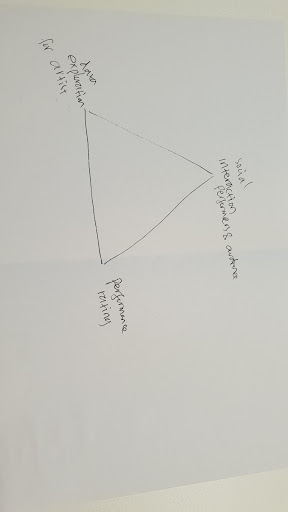
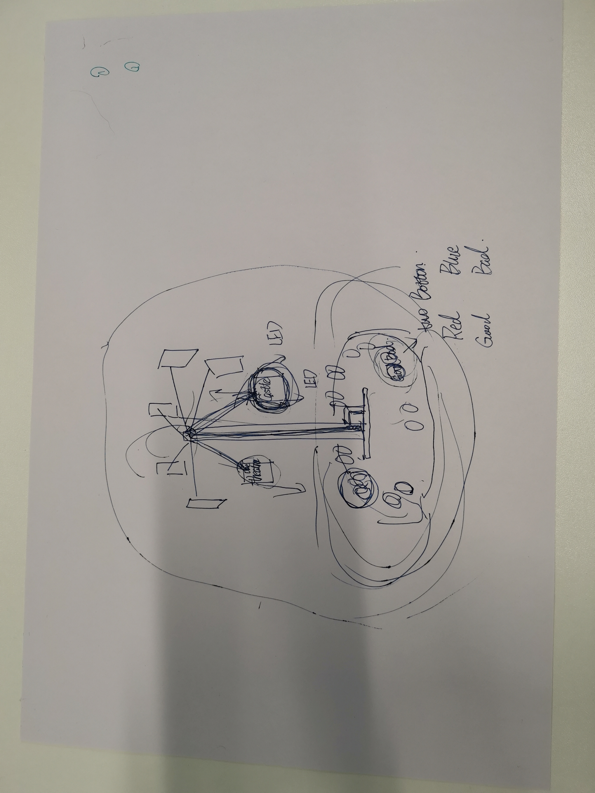
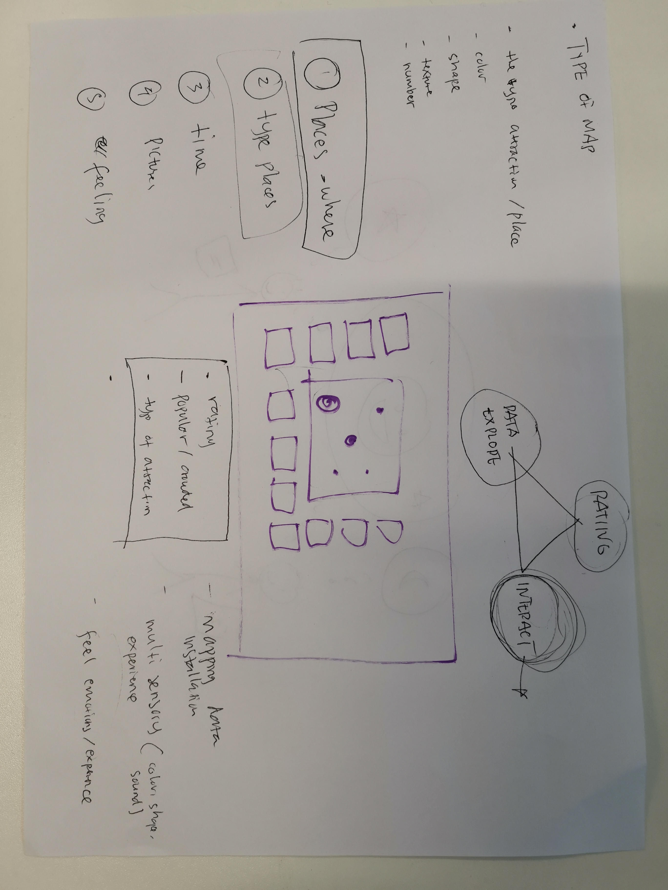
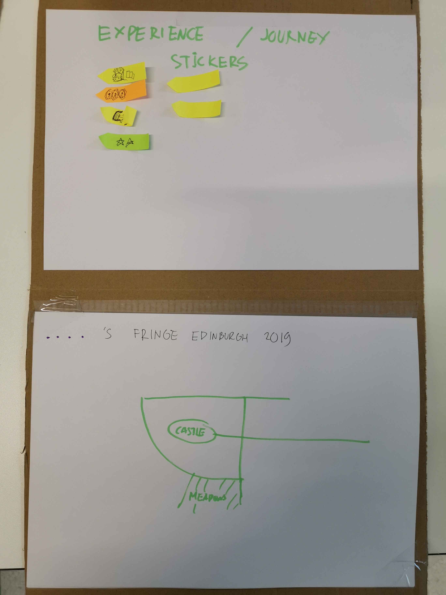
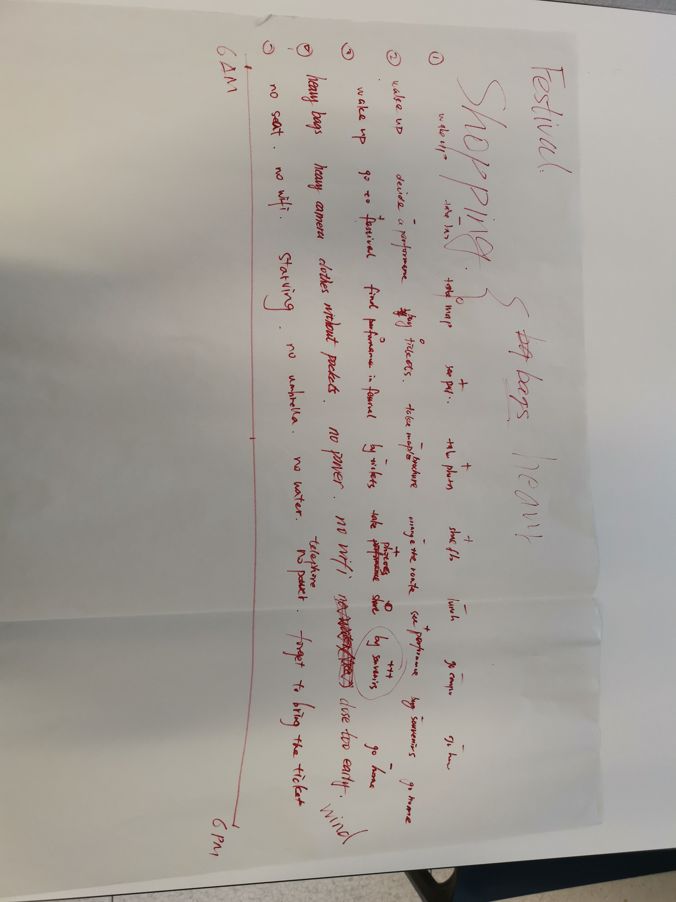
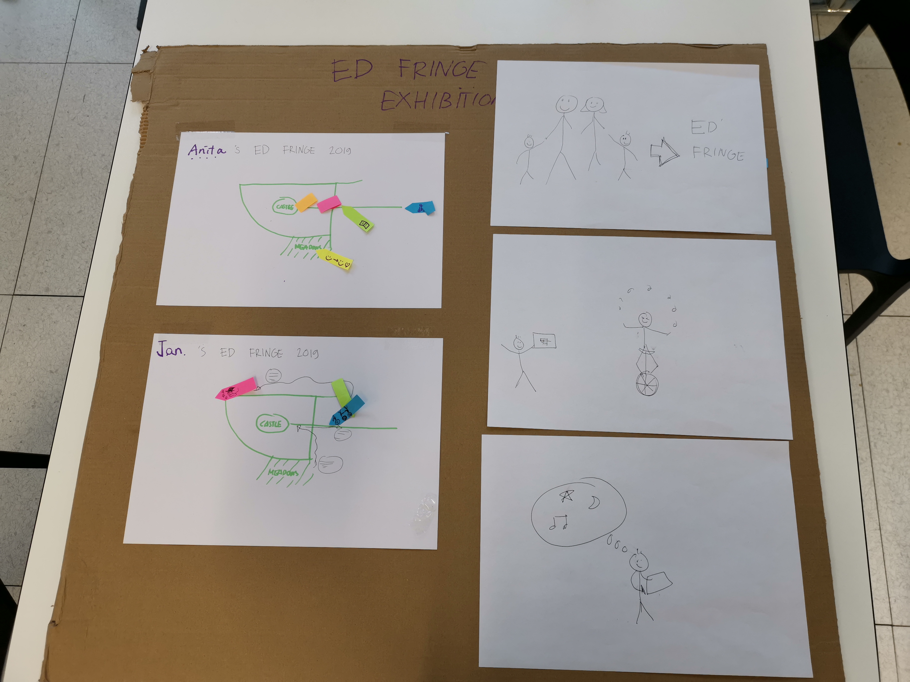

# This is a blog marking down what we have done by step to ge the final show :)

You can use the [editor on GitHub](https://github.com/Cuijie12358/DesignwithData.github.io/edit/master/index.md) to maintain and preview the source code for your website.

Organizers:   
- [Jie Cui](https://github.com/Cuijie12358/)
- [Bramianha Yudana](https://github.com/ianz88)

The website is based on github.io and if you have any suggerstion, you can add issue on the [github link](https://github.com/Cuijie12358/DesignwithData.github.io/edit/master/index.md) or email [me](cuijie12358@outlook.com).

Numbers:
- Bramianha Yudana
- Yixin Liu
- Xinyi Wang
- Xiaoxin Zhang
- Jie Cui


## Timetable.

|What to do|When to do|
|----|----|
|Brainstorming and research|week1-week3|
|Make prototype for the project|week4-week5|
|Build map|week6-week7|
|Build tree |week7-week8|
|Test demo |week8-week9|
|final product for the whole system|week9-week10|

### Week 1 : Friday, 25 Jan 2019 - DI Studio
We decided on three topic as the triangle for the group project:

Social interaction : especially between performers and audience from different country    
Data exploration : see the insight from past festival data; visualize artists data to choose    
Performance rating : how to know which performance is great .   



### Week 2 : Friday, 1 Feb 2019 - DI Studio
Discussing about possible direction for the project and create out first kanban board. The topic is around visualizing the movement of crowd in the city center area on the festival. We are thinking of showing the location of street performance and the density of the crowds around those areas and projecting the visual information onto 3d map model of the city center.

Possible way to do that:
* Create iot device that can detect wifi activity of the crowds and sending it to server
* Access the data from the server and show it as a projection mapping
* Build 3d model of the city center of edinburgh
* Collect the location data of the street performers
* Build web page to access the visualization data

### Week 3 : Friday, 8 Feb 2019 - DI Studio


### Week 4 : Friday, 15 Feb 2019 - DI Studio
We want to solve the problem in this question.









### Week 4 : Sunday, 17 Feb 2019 - DI Studio

# Header 1
## Header 2
### Header 3

- Bulleted
- List

1. Numbered
2. List

**Bold** and _Italic_ and `Code` text

[Link](url) and 
```

For more details see [GitHub Flavored Markdown](https://guides.github.com/features/mastering-markdown/).

### Jekyll Themes

Your Pages site will use the layout and styles from the Jekyll theme you have selected in your [repository settings](https://github.com/Cuijie12358/DesignwithData.github.io/settings). The name of this theme is saved in the Jekyll `_config.yml` configuration file.

### Support or Contact

Having trouble with Pages? Check out our [documentation](https://help.github.com/categories/github-pages-basics/) or [contact support](https://github.com/contact) and we’ll help you sort it out.
