# Welcome!
## This is a blog marking down what we have done by step to ge the final show :)

You can use the [editor on GitHub](https://github.com/Cuijie12358/DesignwithData.github.io/edit/master/index.md) to maintain and preview the source code for your website.

Organizers:   
- [Jie Cui](https://github.com/Cuijie12358/)
- [Bramianha Yudana](https://github.com/ianz88)

The website is based on github.io and if you have any suggerstion, you can add issue on the [github link](https://github.com/Cuijie12358/DesignwithData.github.io/edit/master/index.md) or email [me](cuijie12358@outlook.com).

Numbers:
- Bramianha Yudana
- Yixin Liu
- Xinyi Wang
- Xiaoxin Zhang
- Jie Cui


## Timetable.


### Week 1 : Friday, 25 Jan 2019 - DI Studio
We decided on three topic as the triangle for the group project:   
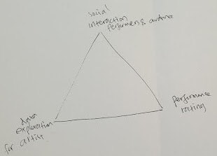

Social interaction : especially between performers and audience from different country    
Data exploration : see the insight from past festival data; visualize artists data to choose    
Performance rating : how to know which performance is great .   


### Week 2 : Friday, 1 Feb 2019 - DI Studio
Discussing about possible direction for the project and create out first kanban board. The topic is around visualizing the movement of crowd in the city center area on the festival. We are thinking of showing the location of street performance and the density of the crowds around those areas and projecting the visual information onto 3d map model of the city center.

Possible way to do that:
* Create iot device that can detect wifi activity of the crowds and sending it to server
* Access the data from the server and show it as a projection mapping
* Build 3d model of the city center of edinburgh
* Collect the location data of the street performers
* Build web page to access the visualization data

Here is our to-do list:   


### Week 3 : Friday, 8 Feb 2019 - DI Studio
In this week we are thinking of making something to show the experience of a person going to the festival.
We imagine we are going to see the street performances, what things are we going to do:   


During the meeting, we are suggested to think about our audience at first.


We also make a brainstorm to think about different ideas such as: **emoji_map** and use it as the first prototype:


We use the **tree** idea later on:   
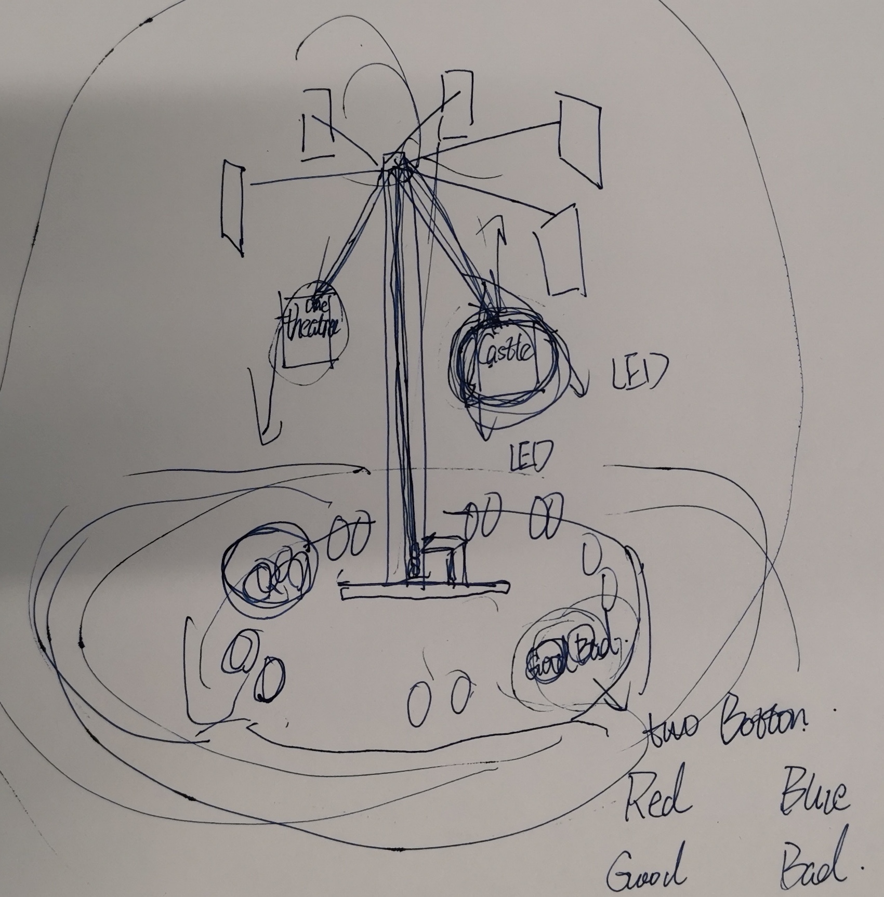

### Week 4 : Friday, 15 Feb 2019 - DI Studio
We focus on the **tree** idea and discuss about the detail things in the meeting.   
We have the idea of showing all the location of street performers on a map and put in the center of our installation for users to explore. We want to give information about which performers are interesting by showing its popularity through a visual cue.

The initial idea is to make a tree with hanging fruit to indicate the popularity based on the height and color of the fruits. The audience of the installation could see the image of video of the performers and vote for the performance that they like.


So we would have two part for the  installation:
* Data collection part to get the rating/popularity of the street performers
* Data visualization part by using the tree to show the rating/popularity


The detailed equipments haven't been decided:   


### Week 5 : Sunday, 24 Feb 2019 - DI Studio
We have notived that the techical part of the tree idea could be unrealistic and if the tree is much taller than a person we do will have no space to make installation, so we move to a new **projection** idea.


### Week 6 : Friday, 1st March 2019
After meeting with our Teacher, Dave, we got some important question to answers:   
* The disconnected experience of the user of the installation from just showing which street performer is popular through videos/ pictures/ map, knowing that the actual street performer are very dynamic in nature.
* Why not consider other type of performance in the festivals.
* Meaningful interaction with the data from the users.

Later our group did some interview and having a pivotal discussion that changes the direction of the project in a big way. Based on the interview, most people just wander around the city if the want to see street performers not based on some review. So we try to find about how people find the shows that they want to see and one of the media of getting the information is by looking at posters.


These posters overload us with huge numbers of information and make it difficult to find the one that might be interesting for each person personal interest. Moreover the number of paper waste and litter that come from these posters.

Some possible reference design regarding to poster (Advertising column and digital display)


But these solutions don’t have additional information about the rating of the shows. So we are thinking of creating some digital display for the posters that could change based on personal interest and influenced by the rating or popularity of the show.

So the main data that we are going to used in our project are:
- Poster of performance
- Review or description of the show based on respected reviewer
- Popularity of the show based on voting mechanism

The main interaction in the installation (through gesture):
- Browsing for posters based on interest (type of shows)
- Finding more detail about the show
- Vote for the show (like it/ want to see it)

The installation layout design:   
   

The proposed gesture interaction module:


The proposed visual element to differentiate between show categories:   


### Week 7 : 5th March 2019
Designing the experience:

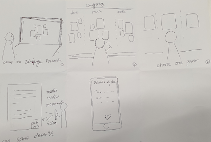


### Week 7 : 9th March 2019
Making Prototype:
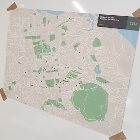
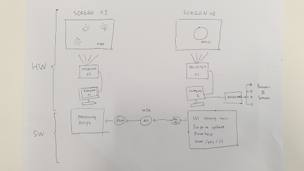


### Week 8 : 15th March 2019
Build the demo:     
Hardware testing:    
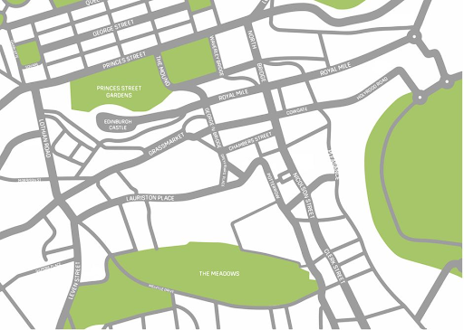
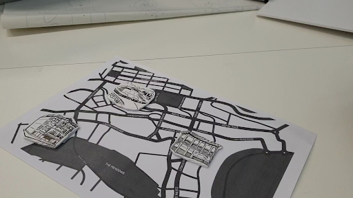
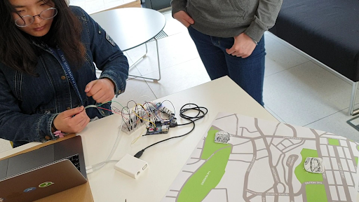

### Week 9 : 19th-22nd March 2019 - Demo
Photos taken from the demo:    
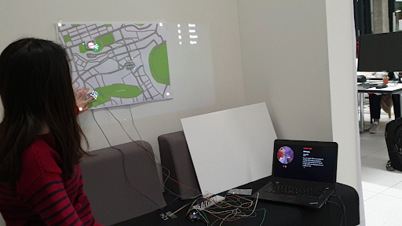
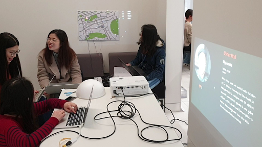

### Week 10 : 29th March 2019
We design the outlook of our prject and build 3D models of the buildings.
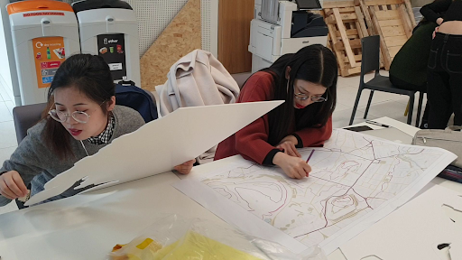
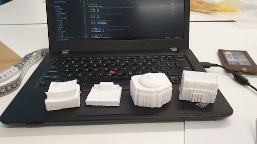   
Design for the box:   
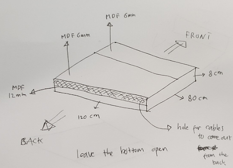.  

Way to interact with the installation:
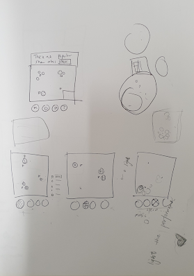
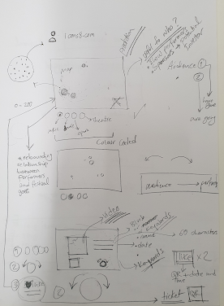

Day-1:
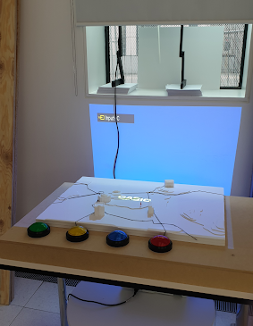

### Week 11 : 1st April 2019 - the Exhibition
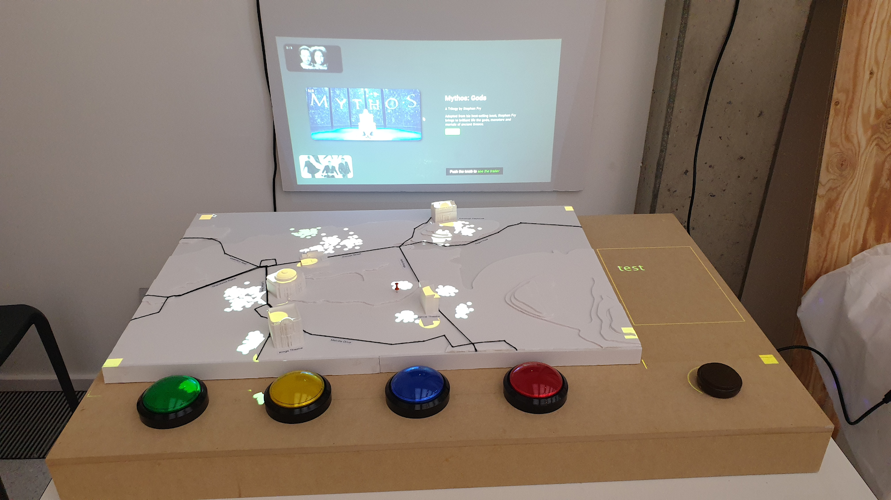
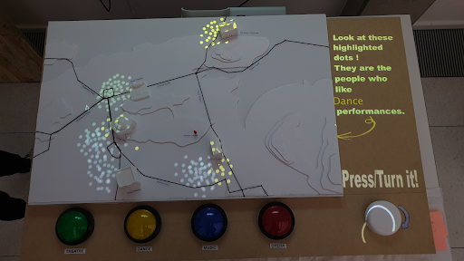


# Header 1
## Header 2
### Header 3

- Bulleted
- List

1. Numbered
2. List

**Bold** and _Italic_ and `Code` text

[Link](url) and 
```

For more details see [GitHub Flavored Markdown](https://guides.github.com/features/mastering-markdown/).

### Jekyll Themes

Your Pages site will use the layout and styles from the Jekyll theme you have selected in your [repository settings](https://github.com/Cuijie12358/DesignwithData.github.io/settings). The name of this theme is saved in the Jekyll `_config.yml` configuration file.

### Support or Contact

Having trouble with Pages? Check out our [documentation](https://help.github.com/categories/github-pages-basics/) or [contact support](https://github.com/contact) and we’ll help you sort it out.
